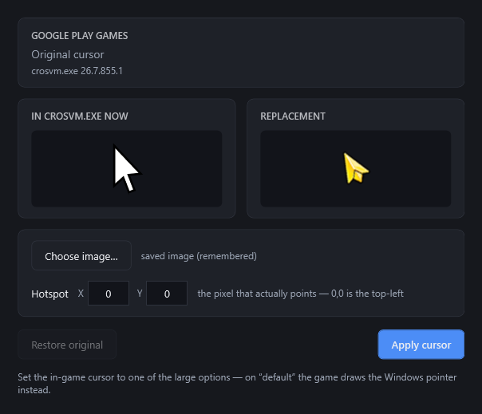

# Play Games Cursor Patcher

Use any cursor you like in Google Play Games on PC.

<p align="center">
  
</p>

## Why

Google Play Games gives you two cursors under **Mouse pointer** — *Standard*,
which is the plain Windows pointer, and *Large*, a 64×64 arrow — and no way to
add your own.

(Its protobuf enum lists a third, `CURSOR_TYPE_GREEN_64X64`, but no green asset
is shipped — `crosvm.exe` carries exactly one `RT_CURSOR` resource. The enum
value is unused, which is why the setting only ever offers two choices.)

That large arrow is an ordinary Win32 `CURSOR` resource — id 6, described by
`GROUP_CURSOR` id 1 — inside `crosvm.exe`, the process that hosts the Android VM
and owns the game window. This app replaces that resource with an image of your
choosing. Nothing is injected, nothing is hooked, no memory is patched: it is a
resource swap on a file on disk.

The feature itself is already switched on. You can see it on the kernel command
line the emulator boots with, in `%LOCALAPPDATA%\Google\Play Games\Logs\AndroidSerial.log`:

```
androidboot.kiwi_cursor.enable_custom_cursor=true
```

## Use

1. Quit Play Games completely — the tray icon, not just the window. A background
   service keeps `crosvm.exe` locked and the patch cannot be written while it runs.
2. Run the app (it asks for administrator, because `crosvm.exe` lives under
   `Program Files`).
3. **Choose image…** — PNG, ICO, CUR or BMP. Anything is scaled to 64×64.
4. Check the hotspot, then **Apply cursor**.
5. Start Play Games and set **Mouse pointer** to **Large**. On *Standard* the game
   draws the Windows pointer and never reads this resource.

### The hotspot

The pixel that actually points, `0,0` being the top-left of the image. A normal
arrow wants `0,0`. A crosshair wants the middle, `32,32`. Cursor files carry
their own hotspot and it is read automatically — and rescaled, so a 48×48 cursor
with a hotspot at 12,9 becomes 16,12 once it is 64×64. Get it wrong and clicks
land somewhere other than where you are pointing.

### After a Play Games update

Updates replace `crosvm.exe` and put the stock arrow back. The app notices and
says so; your image is remembered, so it is one click to reapply. It also takes a
fresh backup of the new build first, so the backup is always a real Google
binary and never an already-patched one.

**Restore original** puts the backup back at any time.

## Build

Needs the [.NET 10 SDK](https://dotnet.microsoft.com/download).

```
dotnet build src/GpgCursorPatcher
```

A single-file executable:

```
dotnet publish src/GpgCursorPatcher -c Release
```

The smoke test patches a throwaway copy of your installed `crosvm.exe` and reads
the cursor back out, so it needs Play Games installed but changes nothing:

```
dotnet run --project tests/SmokeTest
dotnet run --project tests/SmokeTest -- path/to/your.cur
```

## Worth knowing

- **`crosvm.exe` is signed by Google, and editing it invalidates that signature.**
  Play Games does not check today. If it ever starts to, restore the backup.
- The backup and your chosen image live in `%LOCALAPPDATA%\gpg-cursor-patch`.
- Only the 64×64 cursor is touched. The rest of Play Games is untouched, and
  nothing runs in the background — the app does its job and exits.
- Unaffiliated with Google. "Google Play Games" is Google's trademark.

## Licence

MIT — see [LICENSE](LICENSE).
